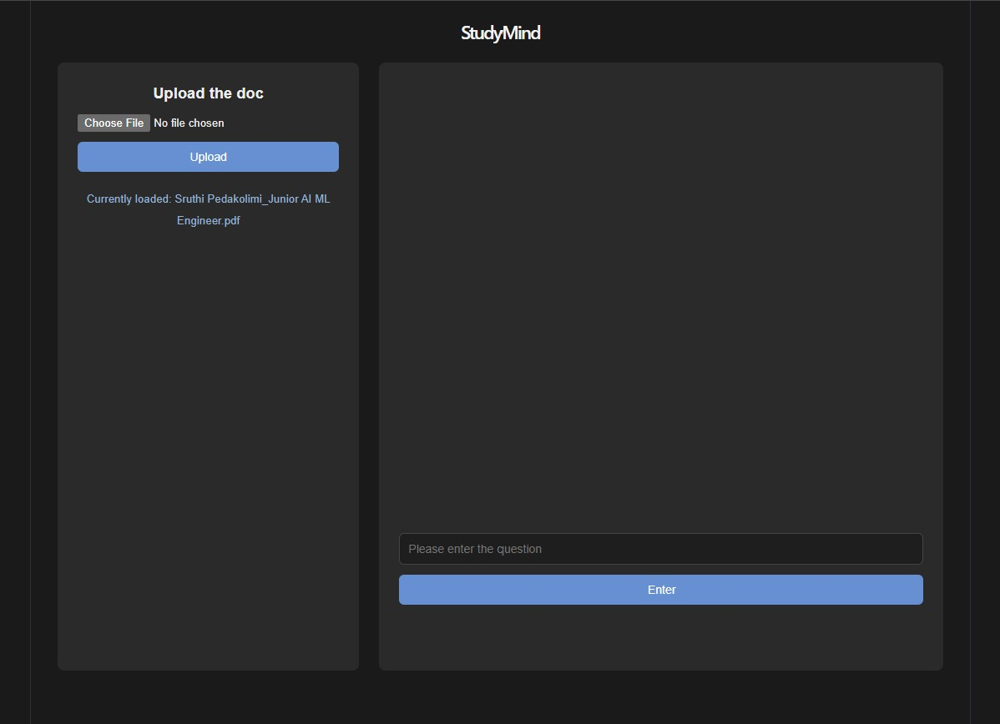
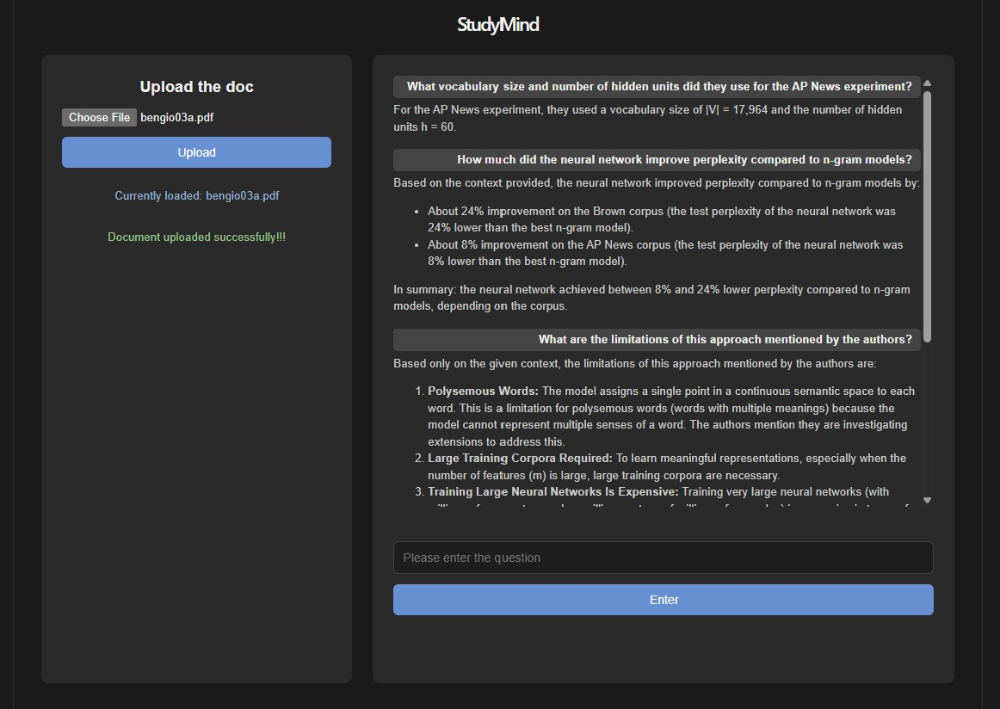

# StudyMind — RAG Study Assistant

Upload a PDF, ask questions about it, and get answers grounded only in that document's content — powered by a retrieval-augmented generation (RAG) pipeline built from scratch.




*Example above uses ["A Neural Probabilistic Language Model" (Bengio et al., 2003)](https://www.jmlr.org/papers/volume3/bengio03a/bengio03a.pdf) as the uploaded document.*

---

## What it does

1. **Upload** a PDF (study notes, papers, textbooks, resumes)
2. The backend extracts the text, splits it into overlapping chunks, and embeds each chunk using OpenAI's `text-embedding-3-small`
3. Embeddings are stored in **ChromaDB**, tagged with a per-document ID
4. **Ask a question** — it's embedded, matched against that document's chunks via similarity search, and the top matches are fed to GPT-4.1 as grounded context
5. GPT-4.1 answers using *only* that retrieved context, rendered as formatted markdown in a chat-style interface
6. Repeated identical questions are served from a **Redis cache**, skipping both the embedding and generation API calls entirely

---

## Tech stack

| Layer | Tools |
|---|---|
| **LLM & embeddings** | OpenAI GPT-4.1 (Responses API), `text-embedding-3-small` |
| **Vector store** | ChromaDB (persistent, single collection, metadata-filtered) |
| **Chunking** | LangChain `RecursiveCharacterTextSplitter` |
| **Caching** | Redis |
| **Backend** | FastAPI, Pydantic, Python 3.12 |
| **Frontend** | React (Vite), `react-markdown` |
| **PDF parsing** | pypdf |

---

## Architecture decisions

Every major design choice here was made deliberately, not by default — happy to walk through the reasoning and tradeoffs on any of these:

**One shared ChromaDB collection, partitioned by `document_id` metadata** — rather than a separate collection per uploaded document. Keeps the system simple to reason about, avoids collection sprawl as documents accumulate, and enables cross-document search later without restructuring. The tradeoff is that every query needs an explicit metadata filter (`where={"document_id": ...}`), which is a small, worthwhile cost.

**Recursive character chunking** (`chunk_size=2000`, `chunk_overlap=200`, ~10% overlap) — It respects natural paragraph/sentence boundaries far better than naive fixed-size splitting, without the extra embedding calls and complexity that semantic chunking would require. Chosen as the "prove the pipeline works end-to-end first" baseline, with semantic chunking identified as the natural upgrade path if retrieval quality demanded it.

**Plain top-k similarity search** (`k=3`) for retrieval, rather than MMR or reranking. Effective for narrow, specific questions; a known, deliberate limitation for broad/summary-style questions (see below).

**Document IDs as UUIDs, decoupled from filenames** — two uploads can share a filename without colliding, and each upload's chunks stay independently trackable and filterable.

**Exact-match Redis caching** on `document_id:question` → answer. Cheap and effective for literal repeat questions. Explicitly *not* a semantic cache — reworded-but-equivalent questions ("what's my experience" vs. "tell me about my work history") won't hit, since that would require embedding every incoming question regardless, which undercuts the point of caching the expensive generation step.

**HTTP status codes chosen by who's actually at fault**, not by convenience — 400 for bad client input, 404 for missing resources, 429/500/503 for upstream OpenAI failures (rate limit, auth, connectivity respectively). Internal failure details (like an invalid API key) are logged server-side but never surfaced to the client — a 500, not a 401, since the *caller* did nothing wrong.

**DRY OpenAI error handling** — every OpenAI call (embeddings, generation) is routed through a single `call_openai_safely()` wrapper that catches rate limit / auth / connection / bad-request errors consistently, rather than duplicating the same four `except` blocks at every call site.

---

## Known limitations

Being upfront about these because understanding *why* something breaks is more valuable than pretending it doesn't:

- **Chunk boundary bleed** — since chunking is based on character count, not topic, unrelated sections can end up merged in the same chunk (e.g. the tail end of a "Work Experience" section bleeding into an adjacent "Technical Skills" list). The chunk still retrieves correctly overall, but drags a bit of irrelevant content along with it.
- **Broad/summary questions retrieve less reliably than narrow ones** — top-k similarity search has no single strong match point for a question like "summarize this document," since no one chunk is more "about the summary" than another. Retrieval quality is noticeably better for specific, narrow questions than open-ended ones.
- **PDF extraction quality depends on layout** — single-column documents (papers, plain notes) extract cleanly; multi-column layouts (like resumes) can interleave text from different columns unexpectedly. Scanned/image-based PDFs with no embedded text aren't supported without adding OCR.
- **No multi-turn conversation memory** — each question is answered independently; the backend doesn't retain context between questions in the same session. A deliberate scope decision (RAG + statelessness first, conversation memory as a clear next iteration), not an oversight.
- **Compound questions retrieve less precisely** — a single query embedding representing two different asks (e.g. "what's my education, and what's my experience?") blends both intents into one vector, which can retrieve chunks that don't fully serve either half.

---

## Running locally

### Backend
```bash
cd backend
python3 -m venv .venv
source .venv/bin/activate
pip install -r requirements.txt

# create .env with:
# OPENAI_API_KEY=your-key
# OPENAI_BASE_URL=https://api.openai.com/v1

# make sure Redis is running:
sudo service redis-server start

fastapi dev main.py
```

### Frontend
```bash
cd frontend
npm install
npm run dev
```

Backend runs on `http://localhost:8000`, frontend on `http://localhost:5173`.

---

## Project structure

```
study-mind/
├── backend/
│   ├── main.py               # FastAPI app: routes, chunking, embedding, retrieval, generation
│   ├── requirements.txt
│   └── chroma_data/          # persistent vector store (gitignored)
├── frontend/
│   └── src/
│       ├── App.jsx
│       └── components/
│           ├── UploadPanel.jsx
│           └── ChatPanel.jsx
└── README.md
```

---

## Roadmap

- [x] PDF ingestion, chunking, embeddings, vector storage
- [x] Retrieval + grounded answer generation (RAG loop)
- [x] Production-style error handling (correct HTTP semantics, DRY OpenAI wrapper, structured logging)
- [x] React frontend with chat history, markdown rendering, `localStorage` persistence
- [x] Redis caching for repeated questions
- [ ] Docker + Docker Compose (backend, frontend, ChromaDB, Redis as separate containers)
- [ ] CI/CD via GitHub Actions
- [ ] PDF preview in the upload panel